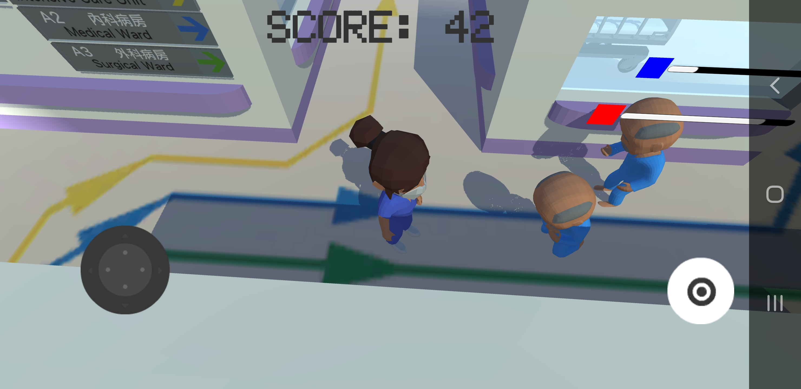
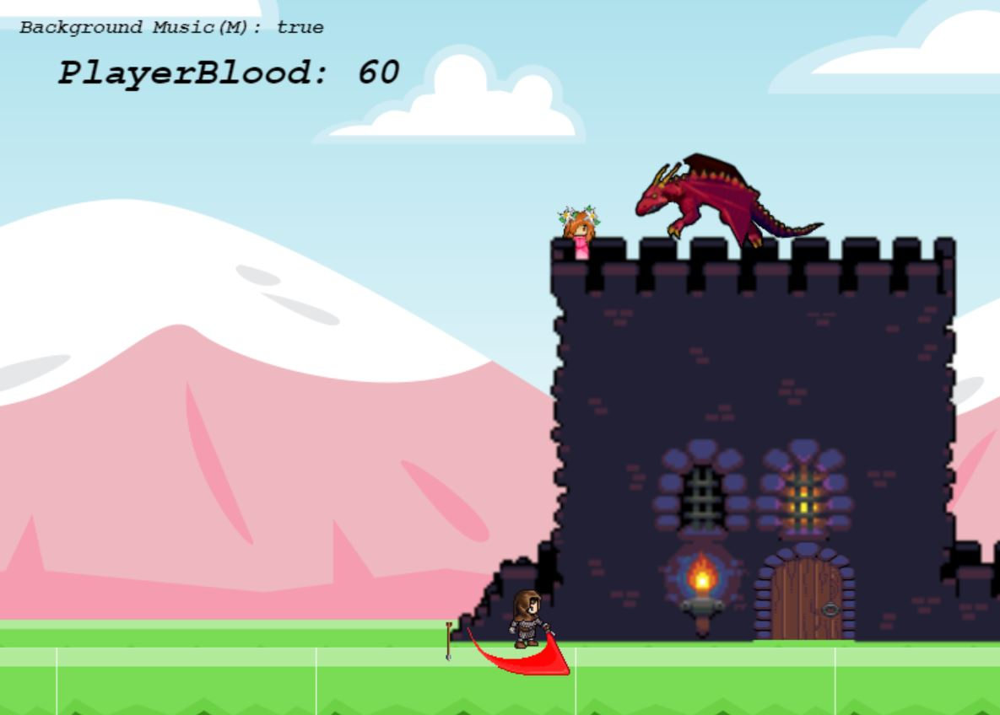

<h1><b>Deep Learning for Content-based Image Retrieval</b></h1>
This was a final year project of BscIMT. AIs were trained with TensorFlow in Python. This project applied deep learning on content-based image retrieval by extracting features from fine-tuned VGG16 and fine-tuned ResNet50. It was found that fine-tuned ResNet50 was a better image descriptor than fine-tuned VGG16.
<iframe width="728" height="410" src="https://www.youtube.com/embed/q0gc9qqTNK4" title="YouTube video player" frameborder="0" allow="accelerometer; autoplay; clipboard-write; encrypted-media; gyroscope; picture-in-picture" allowfullscreen></iframe>

<h1><b>Drum Game for the Elderly</b></h1>
This was a service learning project under the Department of Biomedical Engineering of HKPolyU aimed to provide entertainment for the elderly. This game was developed with Unity. I was responsible for the duo mode, drum beat editing system, UI design and data design of the game.
<iframe width="728" height="410" src="https://www.youtube.com/embed/irHXQbMf88M" title="YouTube video player" frameborder="0" allow="accelerometer; autoplay; clipboard-write; encrypted-media; gyroscope; picture-in-picture" allowfullscreen></iframe>

<h1><b>Overwhelmed!</b></h1>
Overwhelmed is a moblie game developed with Unity. It was a integrated group project of BscIMT of HKPolyU, I involved in the game design and most of the programming part of the game.  
<!---->  
<iframe width="728" height="410" src="https://www.youtube.com/embed/JZnMalX_x2o" title="YouTube video player" frameborder="0" allow="accelerometer; autoplay; clipboard-write; encrypted-media; gyroscope; picture-in-picture" allowfullscreen></iframe> 
<button class="button" onclick="window.open('https://github.com/YuKaWing/YuKaWing.github.io/releases/download/1.0/Overwhelmed.apk')" type="button"><b>Download apk</b></button>
  
<h1><b>My Hero VS Dragon</b></h1>  
My Hero VS Dragon is a web platfom game developed with Phaser 3, a HTML5 game framework. It was a group project of BscIMT in HKPolyU and I involved in the game mechanism design and level designs of  "inside castle", "outside castle" and "cliff".  
   
<button class="button" onclick="window.open('https://yukawing.github.io/MyHeroVSDragon/')" type="button"><b>Click to Play</b></button>
  
<h1><b>Robot car's control system</b></h1>
This was a intergrated project of HDEIE in HKPolyU. The project was aimed to program a control system for a robot car.  
<iframe width="728" height="410" src="https://www.youtube.com/embed/2e2y3eIyW04" title="YouTube video player" frameborder="0" allow="accelerometer; autoplay; clipboard-write; encrypted-media; gyroscope; picture-in-picture" allowfullscreen></iframe>
<iframe width="728" height="410" src="https://www.youtube.com/embed/AA_zwU1kvqY" title="YouTube video player" frameborder="0" allow="accelerometer; autoplay; clipboard-write; encrypted-media; gyroscope; picture-in-picture" allowfullscreen></iframe>
<iframe width="728" height="410" src="https://www.youtube.com/embed/PRHdDNg9J_A" title="YouTube video player" frameborder="0" allow="accelerometer; autoplay; clipboard-write; encrypted-media; gyroscope; picture-in-picture" allowfullscreen></iframe>
